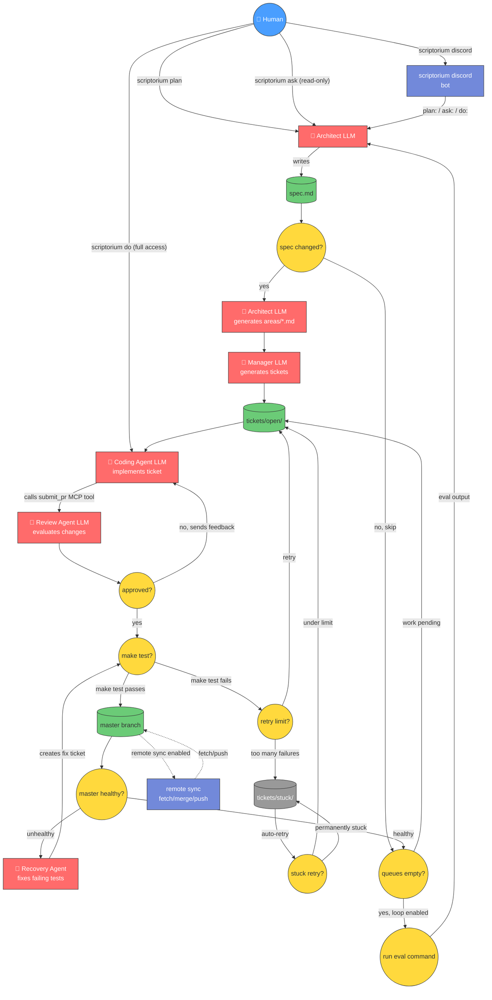

# scriptorium

Git-native agent orchestration for software projects.

Scriptorium keeps planning and execution state in Git, runs a strict Architect → Manager → Coding → Review workflow, and merges work only when `master` stays green.

> **Note:** Scriptorium is experimental. There is no warranty. Letting agents run loose is a bad idea but this is still a fun project. You should probably run this in a container.



**Legend:** 🔴 Red = LLM agent, 🟡 Yellow = code decision, 🟢 Green = git state, 🔵 Blue = human, 🟣 Purple = Discord bot

## Usage

Use `scriptorium plan` to talk to the **Architect** — the planning agent that reads your project source and maintains `spec.md`. The Architect decides what work needs to be done and breaks it into areas and tickets. `scriptorium plan` opens an interactive session where you can describe what you want built or changed, and the Architect updates the spec accordingly.

Use `scriptorium ask` for read-only questions to the Architect. It has the same context as `plan` but won't modify the spec — useful for asking about the codebase, checking status, or getting the Architect's perspective on a design question.

Use `scriptorium do` for ad-hoc tasks that need full repo access — running tests, pushing to remotes, fixing one-off issues, or any work that doesn't belong in the spec. The Architect operates directly in the repo root with no write guards.

Once your spec is ready, run `scriptorium run` in a terminal (or in tmux) to start the main orchestration loop. It watches the spec, generates tickets, assigns coding agents, reviews their work, and merges passing changes into `master`.

```bash
# Tell the Architect what to build
scriptorium plan

# Ask a read-only question
scriptorium ask "What areas of the codebase handle authentication?"

# Run an ad-hoc task with full repo access
scriptorium do "run make test and report the results"

# Once the spec is ready, start the orchestration loop (eg. in tmux)
scriptorium run
```

### Importing an existing project

If you already have a project and want scriptorium to manage it, run
`scriptorium init` in the repo root, then use `scriptorium plan` to tell the
Architect about what's already there:

```bash
scriptorium init
scriptorium plan "Read the existing source code and write a spec that describes the current project structure, features, and areas."
```

The Architect will read your source tree and produce a `spec.md` that matches
the project as it exists. From there you can iterate on the spec to plan new
work, and `scriptorium run` will pick up tickets as usual.

Path and workflow terminology is defined in `docs/terms.md`.

## Status

Current features:
- CLI commands: `init`, `run`, `status`, `plan`, `ask`, `do`, `audit`, `dashboard`, `discord`, `sync`, `worktrees`, `--version`, `--help`
- Architect → Manager → Coding → Review agent workflow
- `do` mode for ad-hoc tasks with full repo access (no ticket pipeline)
- Parallel coding agents with area-based conflict avoidance
- Ticket dependencies (`**Depends:**` field — tickets with unsatisfied deps are skipped)
- Rate limit detection with exponential backoff and concurrency reduction
- Token budget tracking to pause new assignments when stdout bytes exceed limit
- Stuck ticket parking after repeated failures, with automatic retry recovery
- Recovery agent: when master tests fail, the Architect creates and executes a fix ticket automatically
- Remote sync: automatic fetch/merge/push to configured git remotes
- Configurable timeouts, retry limits, and concurrency
- Merge safety with test gates and merge queue
- Loop system for feedback-driven iterative development (eval → architect → work → repeat)
- Web dashboard for monitoring spec, tickets, agents, and logs
- Discord bot integration with mode prefixes (`ask:`, `plan:`, `do:`)
- Claude Code, Codex, and typoi agent harnesses

## Core workflow

At a high level:

1. Engineer describes goals via `scriptorium plan`. The Architect LLM writes and revises `spec.md`.
2. Orchestrator reads `spec.md` and generates `areas/*.md` (Architect).
3. Orchestrator generates `tickets/open/*.md` from areas (Manager).
4. Open tickets are assigned to `.scriptorium/worktrees/tickets/<ticket>/` worktrees and moved to `tickets/in-progress/`. Multiple tickets are assigned concurrently when they touch independent areas.
   - Tickets with unsatisfied `**Depends:**` references are skipped until their dependencies reach `done/`.
5. Coding agent implements the ticket and calls the `submit_pr` MCP tool with a summary.
6. Review agent evaluates the changes — approves or requests changes. Rejected work gets a new coding session with feedback.
7. Merge queue processes one item at a time:
   - merge `master` into ticket branch
   - run `make test` and `make integration-test` in ticket worktree
   - on pass: fast-forward merge to `master`, move ticket to `tickets/done/`
   - on fail: move ticket back to `tickets/open/` and append failure notes
   - on repeated failures: park ticket in `tickets/stuck/`
8. When the loop system is enabled and all queues drain, a feedback command runs and the Architect updates the spec to start the next iteration.

If `spec.md` is missing or still the placeholder, the loop idles and logs:
`WAITING: no spec — run 'scriptorium plan'`

## Quick start

### 1) Prerequisites

- Nim >= 2.0.0
- Git
- `make`
- Agent CLI(s) depending on harness: `claude` ([Claude Code](https://claude.ai/code)), `codex` ([Codex CLI](https://github.com/openai/codex)), or `typoi`

### 2) Build

```bash
nimby sync -g nimby.lock
make build
```

### 3) Initialize a repo

From your project root:

```bash
scriptorium init
```

This creates the orphan branch `scriptorium/plan` with base planning structure.

### 4) Configure agents (optional but recommended)

Create `scriptorium.json` in repo root:

```json
{
  "agents": {
    "architect": { "model": "claude-opus-4-6" },
    "coding":    { "model": "claude-sonnet-4-6" },
    "manager":   { "model": "claude-sonnet-4-6" },
    "reviewer":  { "model": "claude-sonnet-4-6" },
    "audit":     { "model": "claude-haiku-4-5-20251001" }
  },
  "endpoints": {
    "local": "http://127.0.0.1:8097"
  },
  "concurrency": {
    "maxAgents": 4,
    "tokenBudgetMB": 100
  },
  "timeouts": {
    "codingAgentHardTimeoutMs": 14400000,
    "codingAgentNoOutputTimeoutMs": 300000,
    "codingAgentProgressTimeoutMs": 600000,
    "codingAgentMaxAttempts": 5
  },
  "loop": {
    "enabled": false,
    "feedback": "bash scripts/eval.sh",
    "goal": "Improve eval score",
    "maxIterations": 0,
    "feedbackTimeoutMs": 7200000
  },
  "dashboard": {
    "host": "127.0.0.1",
    "port": 8098
  },
  "discord": {
    "enabled": false,
    "serverId": "",
    "channelId": "",
    "allowedUserIds": []
  },
  "logLevel": "INFO",
  "fileLogLevel": "DEBUG"
}
```

Notes:
- Each agent has `harness` and `model` fields. Harness defaults to `claude-code` and is inferred from the model name: `claude-*` → claude-code, `gpt-*` / `codex-*` → codex, other → typoi.
- `concurrency.maxAgents` controls parallel coding agents (default 4).
- `concurrency.tokenBudgetMB` caps cumulative stdout bytes before pausing new assignments (default 0 = unlimited).
- Timeout defaults: 4h hard timeout, 5min no-output timeout, 10min progress timeout, 5 max attempts.
- `endpoints.local` defaults to `http://127.0.0.1:8097` when omitted.
- `logLevel` / `fileLogLevel` can be overridden via `SCRIPTORIUM_LOG_LEVEL` / `SCRIPTORIUM_FILE_LOG_LEVEL` environment variables.

### 5) Build the spec

Interactive mode:

```bash
scriptorium plan
```

One-shot mode:

```bash
scriptorium plan "Add CI checks for merge queue invariants"
```

Planning execution model (both modes):
- Architect runs in a `.scriptorium/worktrees/plan` worktree.
- Prompt includes repo-root path so Architect can read project source.
- Post-run write guard allows only `spec.md`; any other file edits fail the command.
- Planner/manager writes are single-flight via lock file; concurrent planner/manager runs fail fast.

Interactive planning commands:
- `/show` prints current `spec.md`
- `/help` lists commands
- `/quit` exits

### 6) Run orchestrator

```bash
scriptorium run
```

Runtime quality gates:
- Master health runs `make test` and `make integration-test` on `master` before scheduling work.
- Merge queue runs the same two targets in each ticket worktree before fast-forwarding into `master`.

### 7) Loop system (optional)

The loop system enables feedback-driven iterative development. When enabled, the orchestrator runs a feedback command (e.g. an eval script), passes the output to the Architect, and the Architect updates `spec.md` to improve results. The normal pipeline then creates areas, tickets, and coding work from the updated spec.

Configure in `scriptorium.json`:

```json
{
  "loop": {
    "enabled": true,
    "feedback": "bash scripts/eval.sh",
    "goal": "Improve eval score above 90%",
    "maxIterations": 0,
    "feedbackTimeoutMs": 7200000
  }
}
```

- `feedback`: shell command to run for evaluation. Its stdout/stderr is passed to the Architect.
- `goal`: high-level objective the Architect works toward each iteration.
- `maxIterations`: stop after N iterations (0 = unlimited).
- `feedbackTimeoutMs`: timeout for the feedback command in milliseconds (default: 7,200,000 = 2 hours).

The loop runs when all ticket queues are drained: eval → architect updates spec → pipeline creates work → agents implement → merge → repeat.

### 8) Dashboard

```bash
scriptorium dashboard
```

Starts a web UI at `http://127.0.0.1:8098` (configurable via `dashboard.host` and `dashboard.port`). The dashboard shows the current spec, ticket board, merge queue, active agents, and agent logs.

### 9) Discord bot

```bash
scriptorium discord
```

Starts a Discord bot for remote interaction with the orchestrator. Requires the `DISCORD_TOKEN` environment variable.

Messages support mode prefixes to control how the Architect processes them:
- `plan: <message>` — edit `spec.md` (default when no prefix)
- `ask: <message>` — read-only, no file modifications
- `do: <message>` — full repo access for ad-hoc tasks

Slash commands: `/status`, `/queue`, `/pause`, `/resume`.

Configure in `scriptorium.json`:

```json
{
  "discord": {
    "enabled": true,
    "serverId": "your-server-id",
    "channelId": "your-channel-id",
    "allowedUserIds": ["user-id-1"]
  }
}
```

### 10) Logging

`scriptorium run` writes a human-readable log file per session to:

```text
.scriptorium/logs/orchestrator/run_{datetime}.log
```

- `{datetime}` is a UTC timestamp like `2026-02-28T14-30-00Z`
- The directory is created automatically on startup

Every log line is written to both stdout and the log file with the format:

```text
[2026-02-28T14:30:00Z] [INFO] orchestrator listening on http://127.0.0.1:8097
```

Log levels: `DEBUG`, `INFO`, `WARN`, `ERROR`. Logged events include orchestrator startup, tick activity, architect/manager/coding-agent results, merge queue processing, master health checks, and shutdown signals.

To follow a live session:

```bash
tail -f .scriptorium/logs/orchestrator/run_*.log
```

## CLI reference

```text
scriptorium init [path]      Initialize workspace (--init also works)
scriptorium run              Start orchestrator daemon
scriptorium status           Show ticket counts and active agent info
scriptorium plan             Interactive Architect planning session
scriptorium plan <prompt>    One-shot spec update
scriptorium ask              Interactive read-only Q&A with the Architect
scriptorium do               Interactive coding session with full repo access
scriptorium do <prompt>      One-shot ad-hoc task with full repo access
scriptorium audit            Run spec audit
scriptorium dashboard        Start web dashboard
scriptorium discord          Start Discord bot
scriptorium sync             Run a single remote sync cycle (fetch/merge/push)
scriptorium worktrees        List active ticket worktrees
scriptorium --version        Print version
scriptorium --help           Show help
```

## Plan branch layout

`scriptorium/plan` is the planning database. State is files + commits.

```text
spec.md
areas/
tickets/
  open/
  in-progress/
  done/
  stuck/
decisions/
queue/
  merge/
    pending/
    active.md
health/
  cache.json
```

Key invariants:
- A ticket exists in exactly one state directory.
- Ticket state transitions are single orchestrator commits.
- No partial ticket moves are allowed.

## Testing

Local unit tests:

```bash
make test
```

- Runs `tests/test_*.nim`
- No network/API keys required

Integration tests:

```bash
make integration-test
```

- Runs `tests/integration_*.nim`
- Uses real codex and claude-code execution for harness coverage
- Requires:
  - `codex` and `claude` binaries on `PATH`
  - Codex auth: `OPENAI_API_KEY` / `CODEX_API_KEY`, or Codex OAuth (no API key needed)
  - Claude auth: `ANTHROPIC_API_KEY`, or Claude CLI OAuth (no API key needed)
  - CI uses API key secrets; local development can use either approach

Live end-to-end tests:

```bash
make e2e-test
```

- Runs `tests/e2e_*.nim`
- Uses real codex and claude-code execution and full orchestrator flows
- Requires the same auth prerequisites as integration tests

## CI

- `.github/workflows/build.yml`
  - Trigger: `push`, `pull_request`
  - Runs: `make test`

- `.github/workflows/integration.yml`
  - Trigger: `push` to `master`, `workflow_dispatch`
  - Installs `@openai/codex` and `@anthropic-ai/claude-code`
  - Runs: `make integration-test`
  - Uses repo secrets `OPENAI_API_KEY` and `ANTHROPIC_API_KEY`

- `.github/workflows/e2e.yml`
  - Trigger: `push` to `master`, `workflow_dispatch`
  - Installs `@openai/codex` and `@anthropic-ai/claude-code`
  - Runs: `make e2e-test`
  - Uses repo secrets `OPENAI_API_KEY` and `ANTHROPIC_API_KEY`
  - Uploads debug artifacts on failure

This split keeps PR CI safe while still running key-backed integration and e2e coverage on trusted `master` pushes.

## License

MIT. See `LICENSE`.
